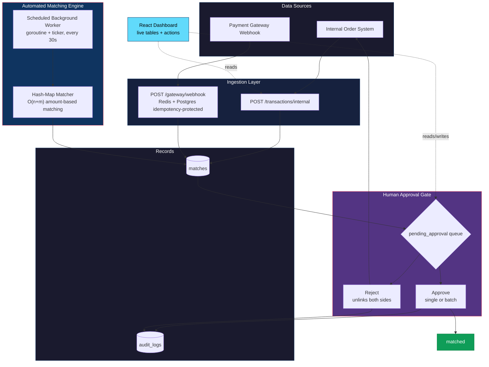
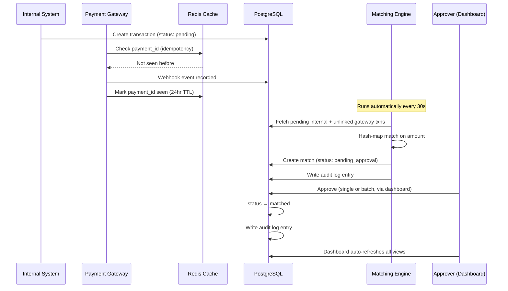
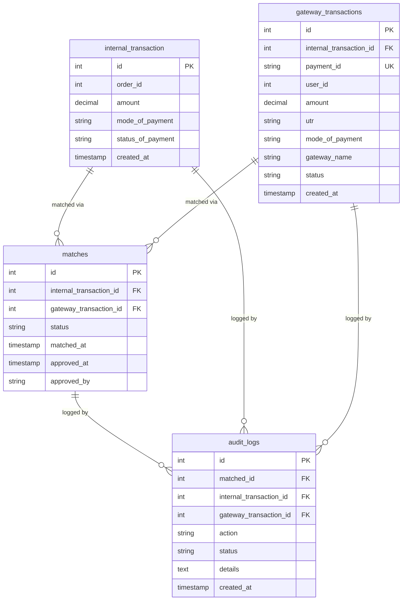
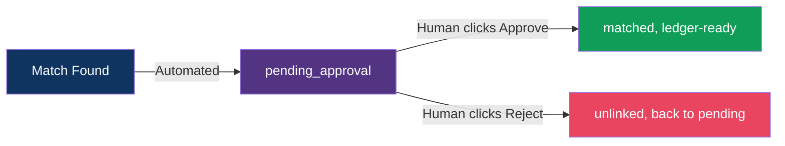

# 💳 Advanced Payment Reconciliation System

<p align="center">
  
  
  
  
  
  
</p>

<p align="center">
  <b>An automated, human-in-the-loop payment reconciliation system</b><br/>
  Ingests transactions from two independent sources, matches them automatically on a schedule,<br/>
  and routes every match through an approval gate before it's considered final — with a live dashboard to watch it happen.
</p>

---

## 📖 Why This Exists

Payment reconciliation is the process every fintech company runs to verify that money recorded **internally** actually matches what a **payment gateway or bank** processed — catching duplicates, missing payments, and mismatches before they become accounting errors.

This project simulates that entire pipeline — ingestion, automated matching, human approval, audit trail, and reporting — the same way production fintech systems are architected, complete with a dashboard to operate it, without relying on a third-party reconciliation SaaS.

---

## 🏗️ Architecture



**The key idea:** ingestion, matching, flagging, and logging are **100% automated** — no manual trigger required in normal operation. The only human action in the entire pipeline is a lightweight approve/reject decision on already-matched transactions, made from the dashboard, right before they're considered final. This mirrors how real reconciliation platforms (Razorpay, HighRadius, etc.) balance automation with financial risk control.

---

## 🔄 Transaction Lifecycle



---

## 🧰 Tech Stack

| Layer | Technology | Why |
|---|---|---|
| **Backend Language** | Go 1.25 | Goroutines + channels for concurrent, scheduled matching without external job queues |
| **Database** | PostgreSQL 16 (`pgx` driver) | ACID transactions, `DECIMAL` for exact currency precision |
| **Cache** | Redis | Fast idempotency pre-check (24hr TTL) before hitting Postgres, backed by a Postgres `UNIQUE` constraint as the source of truth |
| **Web Framework** | Gin | Lightweight routing, JSON binding, middleware, CORS |
| **Frontend** | React (Vite) | Live dashboard — transactions, pending approvals, summary metrics, one-click approve/reject |
| **Migrations** | Raw SQL, versioned | Reproducible schema changes |
| **Containerization** | Docker + Docker Compose | Multi-stage build (`CGO_ENABLED=0`) for a minimal, portable backend image; app + Postgres + Redis on one network |
| **Testing** | Go `testing` package | Table-driven tests covering normal, edge, and adversarial cases |

---

## 🗄️ Database Schema



---

## 🔌 API Reference

### Ingestion
| Method | Endpoint | Description |
|---|---|---|
| `GET` | `/health` | Health check |
| `POST` | `/transactions/internal` | Create an internal transaction |
| `GET` | `/transactions` | List all internal transactions |
| `POST` | `/gateway/webhook` | Receive a payment-gateway event (Redis + Postgres idempotency-protected) |

### Reconciliation
| Method | Endpoint | Description |
|---|---|---|
| `POST` | `/reconcile/run` | Manually trigger a reconciliation cycle *(also runs automatically every 30s)* |
| `GET` | `/matches/pending-approval` | List matches awaiting human approval |
| `POST` | `/matches/:id/approve` | Approve a single match → posts to ledger |
| `POST` | `/matches/approve-batch` | Approve **all** pending matches in one call |
| `POST` | `/matches/:id/reject` | Reject a match and unlink both sides |

### Reporting
| Method | Endpoint | Description |
|---|---|---|
| `GET` | `/reports/summary` | Status breakdown + match-rate percentage |

<details>
<summary><b>Example: creating a transaction pair and reconciling</b></summary>

```bash
# 1. Create an internal transaction
curl -X POST http://localhost:8080/transactions/internal \
  -H "Content-Type: application/json" \
  -d '{"order_id": 501, "amount": 999.00, "mode_of_payment": "UPI"}'

# 2. Simulate the gateway confirming the same payment
curl -X POST http://localhost:8080/gateway/webhook \
  -H "Content-Type: application/json" \
  -d '{"payment_id": "PAY501", "user_id": 1, "amount": 999.00, "utr": "UTR501", "mode_of_payment": "UPI", "gateway_name": "Razorpay"}'

# 3. Trigger reconciliation (or just wait — it runs automatically)
curl -X POST http://localhost:8080/reconcile/run

# 4. Approve the match
curl -X POST http://localhost:8080/matches/1/approve
```
</details>

---

## 🖥️ Dashboard

A React (Vite) frontend gives a live operational view of the whole pipeline:

- **Transactions table** — every internal transaction with a color-coded status badge
- **Pending Approvals table** — matches awaiting a decision, with one-click **Approve** / **Reject**
- **Summary cards** — total transactions, matched count, and match-rate percentage
- All three views **auto-refresh** after any approve/reject action — no manual reload needed

The dashboard talks to the Go backend over REST (CORS-enabled for local development) and is intentionally an **internal/back-office tool** — it's built for the person reconciling payments, not the end customer, who never sees this system directly.

---

## 🧠 Matching Algorithm

Matching is done **in-memory** using a hash map keyed on amount, converted to integer paise (`int64(amount * 100)`) to sidestep floating-point precision issues:

```go
gatewayMap := make(map[int64][]GatewayTxn)   // handles duplicate amounts safely
for _, g := range gatewayTxns {
    key := int64(g.Amount * 100)
    gatewayMap[key] = append(gatewayMap[key], g)
}
```

This gives **O(n + m)** matching instead of an **O(n × m)** nested-loop comparison — the difference between ~2,000 operations and ~1,000,000 for two lists of 1,000 transactions each.

---

## ⚡ Idempotency: Two-Layer Protection

Gateway webhooks can arrive more than once (network retries are normal). This project protects against duplicate processing with two layers:

1. **Redis** — a fast pre-check (`EXISTS idempotency:<payment_id>`, 24hr TTL) that avoids a database round-trip on the common case
2. **Postgres `UNIQUE` constraint** — the actual source of truth, immune to race conditions even if two identical requests arrive at the exact same instant (Redis alone can't guarantee that; a database constraint can)

Redis makes duplicate checks fast; Postgres makes them correct.

---

## 🛡️ Why an Approval Gate?



Real reconciliation platforms don't post matched transactions straight to the books, even when matching itself is fully automated — they insert one human checkpoint right before the ledger write, since money is being committed to permanent records. This project follows the same pattern: **>90% of the pipeline is automated**, and the only manual step is a lightweight approve/reject click, made from the dashboard, on already-matched transactions.

---

## ✅ Testing

Table-driven tests cover the core matching engine — normal matches, no-match cases, duplicate amounts, empty inputs, partial matches, zero/negative amounts, and multi-transaction scenarios:

```bash
go test -v ./internal/matcher/...
```

---

## 🐳 Running with Docker

```bash
docker-compose up --build
```

This spins up three containers — the Go app, PostgreSQL, and Redis — on an isolated network, with the app connecting to each via its service name (`db`, `redis`), not `localhost`. The Go binary is built with a multi-stage Dockerfile (`CGO_ENABLED=0`) so the final image needs nothing but the compiled binary.

Once the containers are up, apply the schema:

```bash
psql -h localhost -U postgres -d reconciliation_db -f internal/db/migrations/<file>.up.sql
# repeat for each migration file, in order
```

Copy `.env.example` to `.env` and fill in your own `DB_PASSWORD` before starting — credentials are never hardcoded or committed.

---

## 🚀 Local Setup (without Docker)

**Backend:**
1. Clone the repo and install dependencies:
   ```bash
   go mod tidy
   ```
2. Copy `.env.example` to `.env` and fill in your database and Redis details.
3. Run the migrations in `internal/db/migrations/` against your local Postgres.
4. Start the server:
   ```bash
   go run cmd/server/main.go
   ```

**Frontend:**
```bash
cd frontend
npm install
npm run dev
```
Runs on `http://localhost:5173` and talks to the backend on `http://localhost:8080`.

---

## 📈 Project Status

| Phase | Description | Status |
|---|---|---|
| 1 | Foundations (Go + Gin + Postgres) | ✅ |
| 2 | Ingestion (internal + gateway, idempotency) | ✅ |
| 3 | Matching engine (hash-map, O(n+m)) | ✅ |
| 4 | Automation (background scheduler) | ✅ |
| 5 | Approval gate (single, batch, reject) | ✅ |
| 6 | Audit logging | ✅ |
| 7 | Reporting (status breakdown, match rate) | ✅ |
| 8 | Testing + Docker | ✅ |
| 9 | Redis-backed idempotency caching | ✅ |
| 10 | React dashboard (live, auto-refreshing) | ✅ |

**Possible future extensions:** event-driven ingestion via a message queue (RabbitMQ/Kafka), tolerance-based fuzzy matching for partial payments, containerized frontend for one-command full-stack startup.

---

<p align="center"><i>Built as a deep, production-adjacent portfolio project — not a tutorial clone.</i></p>